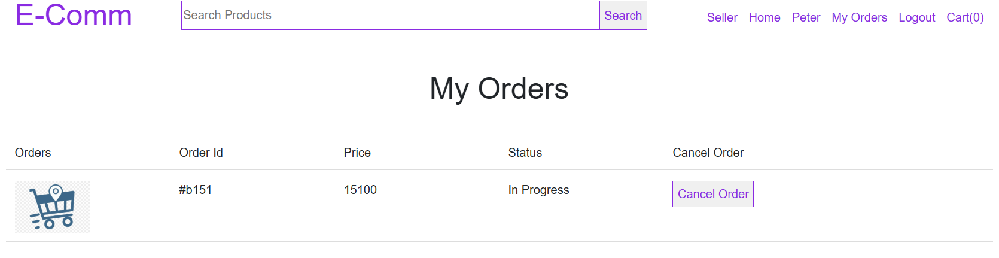
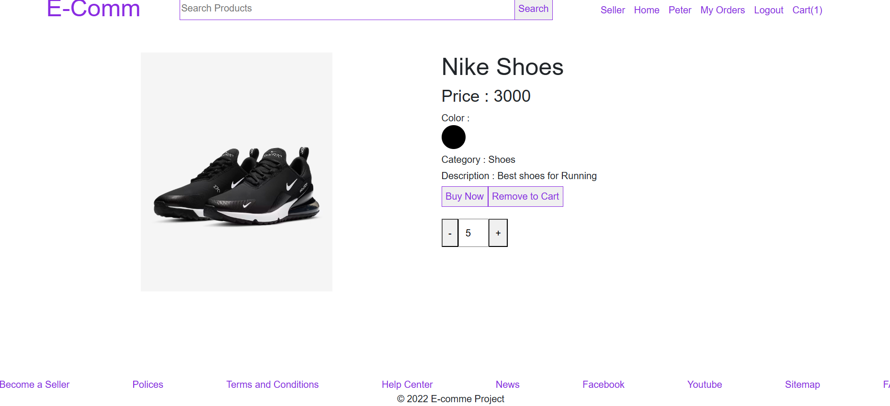
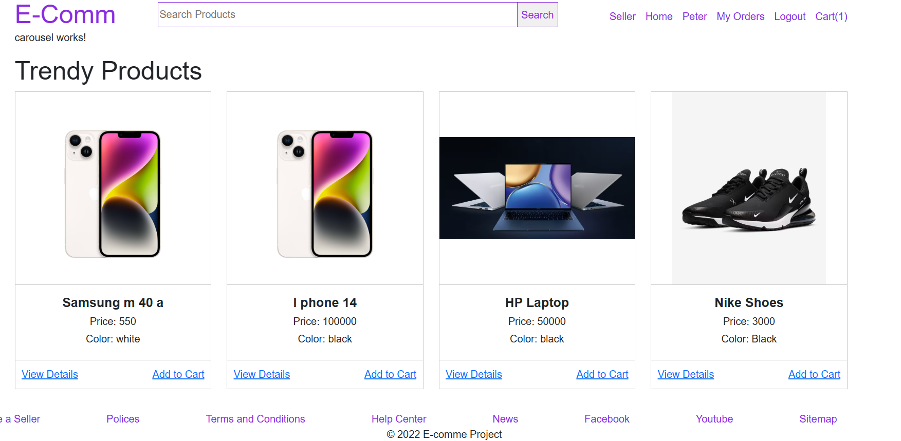
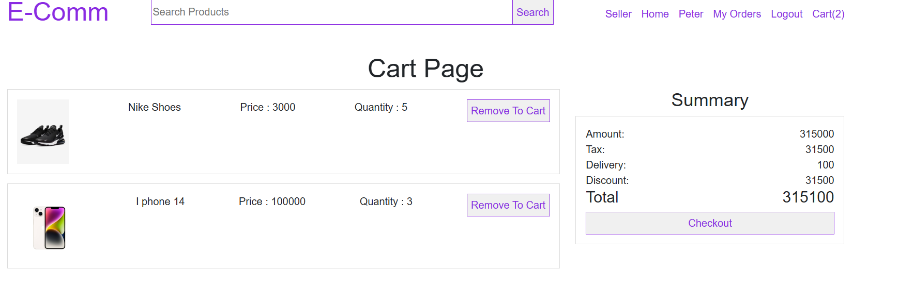

## THE IDEA IS TO IMPROVE THIS PROJECT IS DEPRECATED(old)
|     FIRST VERSION        |      PRIMERA VERSION      |
|--------------------------|---------------------------|
|||
|||

- you can use docker if it doesn't work 
```
docker build -t angular14 .
docker run -p 4200:4200 angular14
```
## 📖 Descripción
JSON Server permite crear una API REST falsa completa con cero configuración de código. Es ideal para prototipado rápido y desarrollo frontend sin necesidad de un backend real.

## SI YA HAS INSTALADO LA API DE FORMA LOCAL SOLO EJECUTA 
```
npm run api
```
## 🚀 Instalación

### Opción 1: Instalación Global (Recomendada)
```bash
npm install -g json-server
```

### Opción 2: Instalación Local en el Proyecto
```bash
npm install json-server --save-dev --legacy-peer-deps
```
## 📁 Ubicación y Estructura

### Con Instalación Global
```
Cualquier ubicación del sistema
├── db.json          ← Base de datos mock
└── json-server      ← Comando disponible globalmente
```
## Correr fakeapi en la ruta donde crees el archivo db.json con la Informacion
```
json-server --watch db.json
```
### Con Instalación Local  
```
mi-proyecto/
├── node_modules/
│   └── json-server/     ← Instalado aquí
├── db.json              ← Base de datos mock
├── package.json
└── scripts: "json-server --watch db.json"
```

## 📄 Crear archivo db.json

```json
{
  "users": [
    { "id": 1, "name": "Juan", "email": "juan@email.com" },
    { "id": 2, "name": "María", "email": "maria@email.com" }
  ],
  "products": [
    { "id": 1, "name": "Laptop", "price": 999 },
    { "id": 2, "name": "Mouse", "price": 25 }
  ]
}
```

## ⚡ Uso Rápido

### Con Instalación Global
```bash
json-server --watch db.json --port 3000
```

### Con Instalación Local
```json
// package.json
{
  "scripts": {
    "json-server": "json-server --watch db.json --port 3000"
  }
}
```

```bash
npm run json-server
```

## 🌐 Endpoints Generados

```
GET    /users          # Obtener todos los usuarios
GET    /users/1        # Obtener usuario por ID
POST   /users          # Crear usuario
PUT    /users/1        # Actualizar usuario
DELETE /users/1        # Eliminar usuario
```

## 🔗 URL de Acceso
- **API Base**: `http://localhost:3000`
- **Ejemplo**: `http://localhost:3000/users`


### DEPENDENCIAS ADICIONALES
```
npm install @fortawesome/fontawesome-svg-core @fortawesome/free-solid-svg-icons @fortawesome/angular-fontawesome
npm install vite-plugin-angular --save-dev
npm install @ng-bootstrap/ng-bootstrap @popperjs/core --force
npm install @angular/platform-browser@18.2.14
 Remove-Item -Recurse -Force node_modules
 Remove-Item -Force package-lock.json
